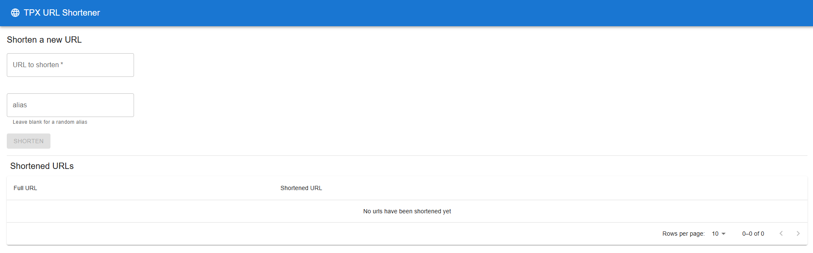

# TPX URL Shortener

Welcome to the TPX URL Shortener project! This application provides a simple and efficient way to shorten URLs. It consists of two main components:

- **Frontend**: A Next.js application for the user interface.
- **Backend**: A Java-based service for handling URL shortening logic and data storage.



## Project Layout

```
.
├── frontend/               # Next.js frontend application
├── backend/                # Java backend service
├── README.md               # This file
├── docker-compose.yaml     # Docker Compose configuration file
└── openapi.yaml            # OpenAPI specification file
```

## Getting Started

### Prerequisites

- Docker and Docker Compose installed
- Node.js v24+ and npm (for frontend development)
- Java 21+ and Maven (for backend development)

> [!TIP]
> You can use devcontainers in VS Code to set up the development environment without installing Node.js and Java locally. See the [VS Code Dev Containers documentation](https://code.visualstudio.com/docs/remote/containers) for more information.

### Development Setup

1. Clone the repository:
   ```bash
   git clone https://github.com/Dante-lor/tpximpact-code-challenge.git
   cd tpximpact-code-challenge
   ```

2. Start the services using Docker Compose:
   ```bash
   docker-compose up
   ```

3. Access the application:
   - Frontend: [http://localhost:3000](http://localhost:3000)
   - Backend API: [http://localhost:8080](http://localhost:8080/swagger-ui/index.html)

## Digging Deeper

Refer to the individual README files for how each one works:

- [Frontend README](frontend/README.md)
- [Backend README](backend/README.md)


